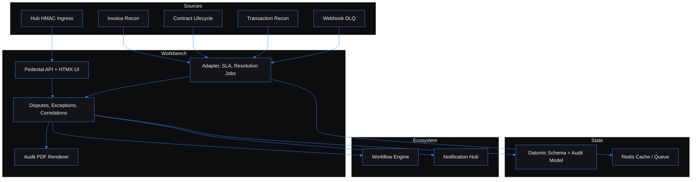

# Dispute Resolution Workbench - tenant-scoped finance dispute operations

Built by [Kingsley Onoh](https://kingsleyonoh.com) / Systems Architect

## The Problem

Finance exceptions usually live in separate systems: invoices in one place, contracts in another, bank-feed mismatches somewhere else, and failed delivery events in a webhook queue. When a dispute crosses those boundaries, no one owns the full case, resolution can stretch from about 18 days to 4 days, and the PRD anchors the recovery target at $40k+ annually for a 100-person SaaS cost base.

Dispute Resolution Workbench turns those fragments into one owned queue: ingest the exception, correlate it, assign a human owner, run the resolution workflow, emit the event, and produce the audit packet.

## Architecture



## Key Decisions

- I chose Clojure maps and pure domain functions over an ORM-heavy CRUD shape because disputes, exceptions, events, and audit rows are data moving through rules.
- I chose Pedestal interceptors over ad hoc route middleware because tenant binding, request ids, rate limits, audit, and auth need a fixed request path.
- I chose server-rendered Hiccup/HTMX over a SPA because this is an operations console with forms, queues, and audit views, not a high-interaction consumer product.
- I chose injectable ecosystem clients over mandatory live services because the core queue must work when adapters, Notification Hub, and Workflow Engine are disabled.
- I chose strict tenant snapshots in PDF templates over shared template context because audit exports must fail closed on cross-tenant data.

## Setup

### Prerequisites

- Clojure CLI with Clojure 1.12 support
- Node.js 20+ and npm for Tailwind CSS
- Docker Desktop for PostgreSQL 16, Redis 7, and Testcontainers
- Java 17+ on the path used by `clojure`

### Installation

```bash
git clone https://github.com/kingsleyonoh/dispute-resolution-workbench.git
cd dispute-resolution-workbench
clojure -P
npm install
```

### Environment

```bash
cp .env.example .env
```

| Variable | Description |
|---|---|
| `APP_ENV` | Runtime environment label. |
| `PORT` | Pedestal HTTP port. |
| `LOG_LEVEL` | Log verbosity. |
| `DEMO_MODE` | Enables demo-friendly runtime behavior. |
| `DATABASE_URL` | PostgreSQL JDBC URL for Datomic SQL storage checks. |
| `DATABASE_POOL` | SQL pool size. |
| `DATOMIC_URI` | Datomic Local URI. |
| `DATOMIC_STORAGE_DIR` | Datomic Local storage path. |
| `DATOMIC_SQL_TRANSACTOR_PROPERTIES` | Datomic SQL transactor properties file. |
| `REDIS_URL` | Redis connection URL. |
| `SELF_REGISTRATION_ENABLED` | Allows `POST /api/tenants/register`. |
| `API_KEY_PREFIX` | Prefix for generated tenant API keys. |
| `SESSION_SECRET` | Secret for UI session signing. |
| `SESSION_COOKIE_NAME` | UI session cookie name. |
| `SESSION_MAX_AGE_SECONDS` | UI session lifetime. |
| `ALLOWED_ORIGINS` | Comma-separated browser origins. |
| `NOTIFICATION_HUB_ENABLED` | Enables outbound Notification Hub events. |
| `NOTIFICATION_HUB_URL` | Notification Hub base URL. |
| `NOTIFICATION_HUB_API_KEY` | Notification Hub API key. |
| `WORKFLOW_ENGINE_ENABLED` | Enables Workflow Engine resolution starts and polling. |
| `WORKFLOW_ENGINE_URL` | Workflow Engine base URL. |
| `WORKFLOW_ENGINE_API_KEY` | Workflow Engine API key. |
| `INVOICE_RECON_ENABLED` | Enables invoice discrepancy polling. |
| `INVOICE_RECON_URL` | Invoice Reconciliation base URL. |
| `INVOICE_RECON_API_KEY` | Invoice Reconciliation API key. |
| `INVOICE_RECON_POLL_INTERVAL_SECONDS` | Invoice poll interval. |
| `CONTRACT_LIFECYCLE_ENABLED` | Enables contract backfill and NATS handling. |
| `CONTRACT_LIFECYCLE_URL` | Contract Lifecycle base URL. |
| `CONTRACT_LIFECYCLE_API_KEY` | Contract Lifecycle API key. |
| `CONTRACT_LIFECYCLE_BACKFILL_INTERVAL_SECONDS` | Contract backfill interval. |
| `NATS_ENABLED` | Enables NATS event consumption. |
| `NATS_URL` | NATS server URL. |
| `NATS_CREDS_PATH` | Optional NATS credentials path. |
| `NATS_STREAM_NAME` | NATS stream name. |
| `TRANSACTION_RECON_ENABLED` | Enables transaction discrepancy polling. |
| `TRANSACTION_RECON_URL` | Transaction Reconciliation base URL. |
| `TRANSACTION_RECON_API_KEY` | Transaction Reconciliation API key. |
| `TRANSACTION_RECON_POLL_INTERVAL_SECONDS` | Transaction poll interval. |
| `WEBHOOK_ENGINE_ENABLED` | Enables Webhook Engine DLQ polling. |
| `WEBHOOK_ENGINE_URL` | Webhook Engine base URL. |
| `WEBHOOK_ENGINE_API_KEY` | Webhook Engine API key. |
| `WEBHOOK_ENGINE_DLQ_POLL_INTERVAL_SECONDS` | DLQ poll interval. |
| `HUB_INGRESS_SECRET` | HMAC secret for public Hub exception ingress. |
| `AUTO_MERGE_THRESHOLD` | Correlation score needed for auto-merge. |
| `REVIEW_THRESHOLD` | Correlation score needed for human review. |
| `CORRELATION_WINDOW_DAYS` | Time window used by correlation scoring. |
| `MAX_INGESTION_BATCH_SIZE` | Maximum adapter batch size. |
| `DEFAULT_SLA_MINUTES` | Default SLA target for assigned disputes. |
| `SLA_REAPER_INTERVAL_SECONDS` | SLA reaper interval. |
| `RESOLUTION_POLL_INTERVAL_SECONDS` | Workflow resolution poll interval. |
| `SENTRY_DSN` | Optional Sentry DSN for injected capture. |
| `AXIOM_TOKEN` | Optional Axiom token for log shipping boundary. |
| `AXIOM_DATASET` | Dataset name for JSON log records. |
| `POSTHOG_API_KEY` | Reserved analytics key. |
| `POSTHOG_HOST` | Reserved analytics host. |
| `PROMETHEUS_ENABLED` | Enables `/metrics`. |
| `METRICS_BASIC_AUTH_USER` | Metrics Basic auth username. |
| `METRICS_BASIC_AUTH_PASS` | Metrics Basic auth password. |
| `AUTO_SEED` | Enables first-run seed behavior. |

### Run

```bash
docker compose up -d postgres redis
npm run build:css
clojure -M:dev
```

The app listens on `http://localhost:3049` by default.

## How It Works

```text
External exception
  -> adapter or HMAC Hub ingress
  -> normalized exception
  -> correlation scoring
  -> dispute queue
  -> operator assignment and investigation
  -> Workflow Engine resolution
  -> Notification Hub event
  -> audit PDF
```

From a finance operator's perspective, the system answers one question: "Who owns this exception, what is blocking it, and what proof exists when it closes?"

## Usage

Start with the API because the UI uses the same tenant-scoped domain model.

### 1. Register a Tenant

```bash
curl -s -X POST http://localhost:3049/api/tenants/register \
  -H "Content-Type: application/json" \
  -d '{"name":"Acme Finance Ops"}'
```

Response shape:

```json
{
  "id": "tenant-uuid",
  "name": "Acme Finance Ops",
  "slug": "acme-finance-ops",
  "apiKey": "drw_live_..."
}
```

Use that key on tenant-scoped API calls:

```bash
export DRW_API_KEY="drw_live_..."
```

### 2. Create and Work a Dispute

```bash
curl -s -X POST http://localhost:3049/api/disputes \
  -H "X-API-Key: $DRW_API_KEY" \
  -H "Content-Type: application/json" \
  -d '{"title":"Invoice mismatch INV-100","description":"Invoice total does not match ledger total.","category":"billing","severity":"high","currency":"EUR"}'
```

The API returns `{ "dispute": { ... } }` with fields such as `id`, `reference`, `status`, `category`, `severity`, `monetaryImpactCents`, and `createdAt`.

Assign it:

```bash
curl -s -X PATCH http://localhost:3049/api/disputes/{id}/assign \
  -H "X-API-Key: $DRW_API_KEY" \
  -H "Content-Type: application/json" \
  -d '{"user_id":"33333333-3333-3333-3333-333333333333"}'
```

Move it into investigation:

```bash
curl -s -X PATCH http://localhost:3049/api/disputes/{id}/transition \
  -H "X-API-Key: $DRW_API_KEY" \
  -H "Content-Type: application/json" \
  -d '{"to_status":"investigating"}'
```

### 3. Attach an Exception

```bash
curl -s -X POST http://localhost:3049/api/exceptions \
  -H "X-API-Key: $DRW_API_KEY" \
  -H "Content-Type: application/json" \
  -d '{"source_ref":"MAN-100","kind":"manual","currency":"EUR","observed_at":"2026-05-05T10:00:00Z","monetary_impact_cents":4200}'
```

Then attach the returned exception id:

```bash
curl -s -X POST http://localhost:3049/api/disputes/{id}/attach-exception \
  -H "X-API-Key: $DRW_API_KEY" \
  -H "Content-Type: application/json" \
  -d '{"exception_id":"exception-uuid"}'
```

### 4. Start a Resolution Playbook

Create a playbook:

```bash
curl -s -X POST http://localhost:3049/api/playbooks \
  -H "X-API-Key: $DRW_API_KEY" \
  -H "Content-Type: application/json" \
  -d '{"code":"credit-note-and-refund","display_name":"Credit note and refund","workflow_engine_workflow_id":"wf-credit"}'
```

Start resolution:

```bash
curl -s -X POST http://localhost:3049/api/disputes/{id}/start-resolution \
  -H "X-API-Key: $DRW_API_KEY" \
  -H "Content-Type: application/json" \
  -d '{"playbook_id":"playbook-uuid"}'
```

When the injected or configured Workflow Engine reports success, the resolution poller moves the dispute to `resolved` and emits `dispute.resolved`.

### 5. Export the Audit PDF

```bash
curl -s http://localhost:3049/api/disputes/{id}/audit-pdf \
  -H "X-API-Key: $DRW_API_KEY" \
  -o dispute-audit.pdf
```

The report includes the tenant snapshot, dispute fields, exceptions, timeline entries, audit rows, and resolution summary.

### Operator UI

The server-rendered console is available at `http://localhost:3049/`.

Core flows:

1. Sign in with a tenant API key.
2. Review the bounded dashboard and dispute queue.
3. Assign, transition, comment, and attach exceptions from the dispute detail page.
4. Review correlation candidates.
5. Manage ingestion sources and playbooks.
6. Start resolution and download the audit PDF.

### What It Handles

| Concern | Built behavior |
|---|---|
| Tenant isolation | API-key tenant binding, tenant-scoped queries, cross-tenant 404s. |
| Duplicate ingestion | Same-tenant source refs are rejected or skipped. |
| Correlation review | Candidate scoring, pending queue, accept/reject actions. |
| External outages | Adapters are feature-flagged and failure-isolated. |
| Resolution side effects | Workflow Engine boundary owns execution; Workbench owns dispute state. |
| Notifications | Hub events emitted through a feature-flagged client boundary. |
| Audit export | Strict Selmer template and PDF artifact storage with hash metadata. |

## Tests

```bash
clojure -M:test
clojure -M:test:e2e
clojure -M:clj-kondo --lint src test
clojure -M:cljfmt check
```

Latest local verification:

```text
160 tests, 869 assertions, 0 failures
```

## AI Integration

This project includes machine-readable context for AI tools:

| File | What it does |
|------|-------------|
| [`llms.txt`](llms.txt) | Project summary for LLMs ([llmstxt.org](https://llmstxt.org)) |
| [`AGENTS.md`](AGENTS.md) | Full codebase instructions for AI coding agents |
| [`openapi.yaml`](openapi.yaml) | OpenAPI 3.1 API specification |
| [`mcp.json`](mcp.json) | MCP server definition for AI IDEs |

### Cursor / Other AI IDEs

Point your AI agent at `AGENTS.md` for full codebase context.

## Deployment

This project is shipped as code but is not deployed. `docker-compose.prod.yml` remains in the repository as a packaging reference with app, PostgreSQL, and Redis services, but the configured Traefik host is not reachable and no Live URL is advertised.

For local container packaging:

```bash
docker compose -f docker-compose.prod.yml up -d
```

Set the environment variables listed in **Setup > Environment** before starting.

<!-- THEATRE_LINK -->
